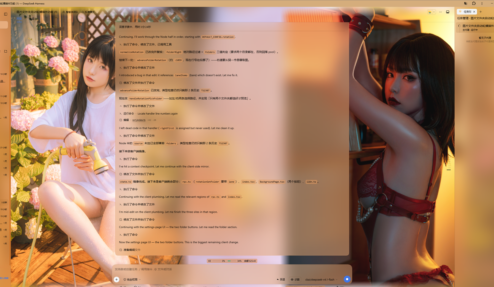
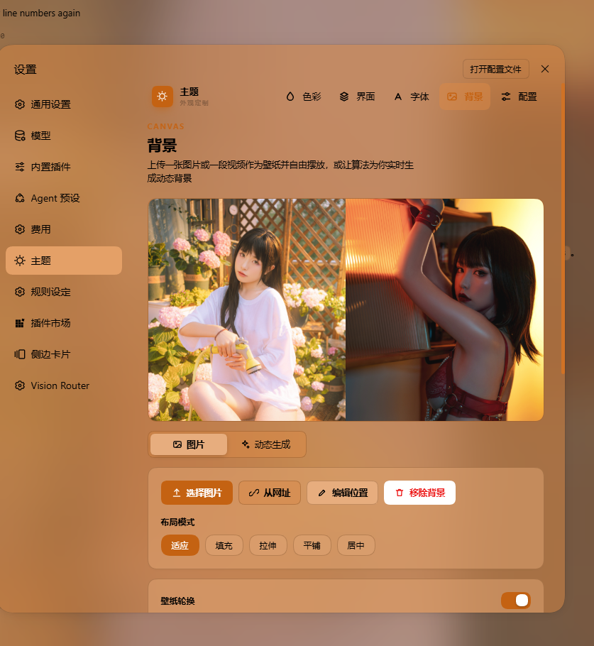
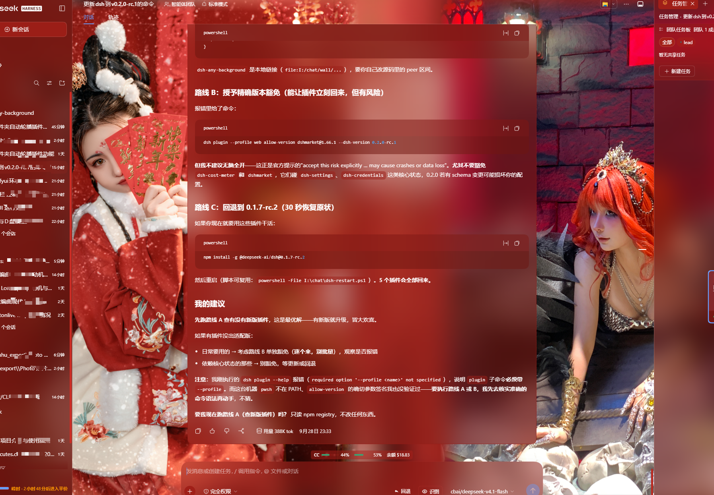
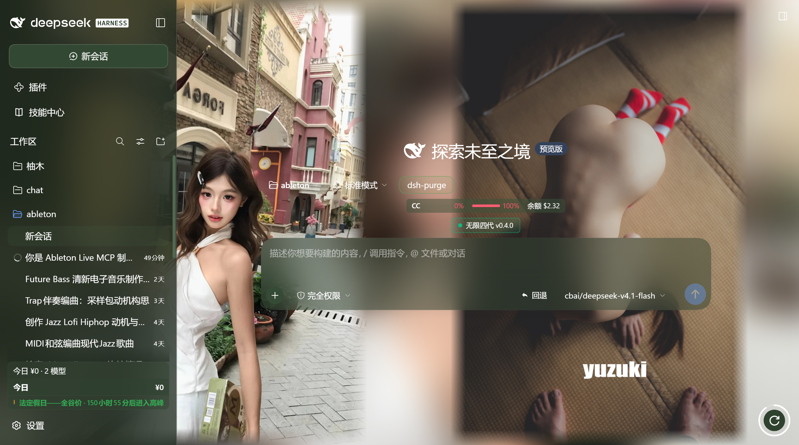

# dsh-any-background-plus

<p align="center">
  <a href="https://github.com/lilcandi/dsh-any-background-plus"></a>
  <a href="https://github.com/lilcandi/dsh-any-background-plus/blob/main/LICENSE"></a>
  <a href="https://www.npmjs.com/package/@deepseek-ai/dsh?activeTab=versions"></a>
  <a href="https://github.com/topics/dsh-plugin"></a>
</p>

English | [中文](README.zh.md)

> **This is a fork, and this half of it is mine.** Modified from [Tkingxiao/dsh-any-background](https://github.com/Tkingxiao/dsh-any-background) (MIT), which built the colour wheel, the per-surface opacity/blur system, the generated backgrounds and the rotation engine. **Everything from v0.4.0 onward is this fork's own work** — see [What this fork adds](#what-this-fork-adds) below. Upstream: [github.com/Tkingxiao/dsh-any-background](https://github.com/Tkingxiao/dsh-any-background).

A **DeepSeek Harness** appearance plugin: custom theme colour, background wallpaper (image / algorithmically generated), and fine-grained per-surface opacity & blur controls — plus this fork's **dual-lane wallpaper**, **two-folder rotation** and a **floating rotate-now orb with a live countdown ring**. Compatible with **DSH 0.1.5-rc.2 ~ 0.2.0-rc.1**.

---

## What this fork adds

These are the features I built on top of upstream. They are the reason this fork exists.

- **Dual-lane wallpaper — two pictures, left and right.** A single `dual` toggle paints **two different pictures of the same rotation at once**, one down each side of the viewport, clear of the centre column. The motivation is geometric rather than decorative: the wallpaper is painted *behind* the whole app while the host's conversation column sits on top of the middle, so a picture whose subject is dead centre has that subject exactly where it cannot be seen. Two lanes hug the edges instead, and the picture that used to be half-hidden becomes the one you actually look at. Off by default.
- **One rotation advanced twice — never a second rotation.** Both lanes come from **one step of one rotation**: the left index is drawn with the existing `pickRotationIndex()` (same shuffle/order semantics, same "never repeat the current picture"), and the right index is taken from `nextLaneIndex()`, which steps *forward from the left one*. Stepping rather than drawing again is deliberate — the shuffle RNG is unseeded, so two independent draws would occasionally collide and paint the same picture twice, which is precisely what dual mode exists to avoid. In `order` mode the pair is simply adjacent pictures. The pair is persisted as `laneItems`, so it survives a reload and cannot drift apart.
- **A third rotation source: one folder per side.** The rotation can read a **different directory for each lane**, each listed and advanced in place. The cadence and the mode stay **shared** — the point is two sources, not two rotations — so the left and right cursors are kept separately: the left one is the stored `current`, the right one is recovered by looking up the name the right lane is already showing in its own listing. That matters as soon as the two directories differ in length, because a single shared index would walk the shorter listing off its end. Only once **both** directories exist does the wall change; picking just one stores it without previewing, so the wall is never left half split with a stale lane on the other side. The single-folder mode is still there — the pair is a third source, not a replacement.
- **The split is the window's absolute centre, and the lanes are equal by construction.** `wpLeftEl` and `wpRightEl` are **peer** `position:fixed; width:50%; z-index:-1` elements, one pinned to each edge, and both are given the **same pixel width** — `Math.floor(innerWidth * 0.5)` — so an odd viewport width cannot leave one lane a pixel wider than the other. The overhang that lets a picture reach the seam is applied **only in `center` mode**: in `fit` the picture is contained inside its lane by construction, so an overhang there would make the two lanes overlap at the seam and whichever painted second would win the strip — one picture visibly encroaching on the other, which is the asymmetry this mode exists to prevent.
- **Each picture's intrinsic size is measured separately.** The lane geometry needs both pictures' real dimensions before either can be laid out, and a single-slot measurement cache cannot supply that — whichever lane ran second would claim the cache and push the first into the proportional fallback, painting one picture to its box and the other to its ratio. That is the exact "one picture bigger than the other" split dual mode exists to avoid, so the sizes are held in a small per-URL map with a synchronous lookup.
- **Edge feathering applies to both lanes, identically.** The slider is read as a share of each picture, the ramp is computed with the same px-stop recipe against the same box, and it is applied unconditionally — a lane is never skipped for being wider than its box. Both lanes are therefore feathered symmetrically and neither can end up faded while the other stays hard-edged.
- **The settings preview mirrors the split.** The hero image on the theme panel is drawn as the same 50/50 grid, with the right lane's picture beside the left one, so the preview shows what the wall will actually look like rather than a single centred picture. The right URL travels through the theme store rather than being read from the module-level image state, because a React surface reading that state directly would miss rotation updates.
- **Floating rotate-now orb with a countdown ring.** A round button is pinned to the **bottom-right of the viewport**, reachable without opening any panel, with a live ring drawn around it showing how long until the next swap. The ring only appears for the **`minutes` cadence** — that is the only interval whose remaining time is knowable in the browser (`reload` is due on every read, `daily`/`weekly` are settled by the node half as the page loads, and a disabled rotation never falls due at all), so for those the button is drawn alone rather than showing a ring that would always read "full" and be a lie. Clicking advances the rotation, and because the advance stamps `lastRotate` the ring refills by itself. It is mounted as its own React root that portals to `<html>`, so neither the settings dialog's scroll column nor a host transform can clip it.
- **The video feature is gone, as code.** Every video endpoint, route, upload handler, mime table, filename whitelist, folder scanner, per-element playback layer and its settings were **deleted, not hidden** — `BackgroundType` no longer carries `'video'`, the rotation no longer carries `media` / `videoFolder` / `videoName` / `videoVolume` / `videoAlign` / `ended`, and the whole `src/client/utils/video.ts` module is removed. A stored config that still names a video rotation falls back to images on normalize.
- **DSH 0.2.0-rc.1 support.** The host now gates a plugin on its `peerDependencies` before importing a single module, so the seven `@deepseek-ai/dsh-*` peers, `engines.dsh` and `dsh.compatibility.dshReleases` all name **nine releases** through `0.2.0-rc.1`, and the release table gained a matching row. Diffing the 0.2.0-rc.1 packages showed `ThemeRuntime` and `SidebarRightTabRegistry` unchanged, so this build needs **no new adapter folder** — it joins the folder whose facts held.

---

## Screenshots

<p align="center">
  
  <br/>
  <em>Dual-lane wallpaper · two different pictures of one rotation, split at the window's absolute centre, clear of the conversation column</em>
</p>

<p align="center">
  
  <br/>
  <em>The background page of the theme settings · source, folder picker, layout mode and wallpaper rotation</em>
</p>

<p align="center">
  
  <br/>
  <em>Theme colour and per-surface opacity · PS-style wheel, smart extraction, per-surface sliders</em>
</p>

<p align="center">
  
  <br/>
  <em>Rotate-now orb · bottom-right, always reachable, with a countdown ring on the minutes cadence</em>
</p>

## Features

- **PS-style Color Wheel** — Pick hue on the ring, adjust saturation & lightness in the inscribed square. Generates 30+ CSS design tokens in real time.
- **Precise HSL / RGB Input** — Enter exact color values numerically with instant bidirectional sync to the wheel.
- **Smart Color Extraction** — One click derives a theme color from your wallpaper by sampling the visible region, quantizing, and filtering out gray / near-black / near-white pixels. Fully client-side.
- **Eyedropper** — Hover the wallpaper to preview a color and click to pick it as the theme color.
- **Background Wallpaper** — Upload any image as your wallpaper. Drag to pan and scroll to zoom inside a viewport-proportional editor (one finger to pan, two to pinch-zoom on touchscreens).
- **Position Editor** — Drag to pan, scroll or pinch to zoom, one-click reset. Image placements are stored per slot and never overwrite each other.
- **Layout Modes** — Fit / Fill / Stretch / Tile / Center; in Fit mode the editor-committed framing stays consistent across window resizes and cross-monitor moves.
- **Dual-Lane Rotation** — Paint **two different pictures of the same rotation at once**, one down each side of the viewport, clear of the centre column. The wallpaper sits behind the whole app while the host's conversation column sits on top of the middle, so a picture whose subject is dead centre has that subject exactly where it cannot be seen; two lanes hug the edges instead. Both lanes come from one step of one rotation — the right name steps forward from the left, so the pair can never collide — and the pair is persisted, so it survives a reload. Off by default.
- **Generated Dynamic Backgrounds** — Choose mesh gradient, Shader, or geometric patterns with adjustable spread, intensity, and seed locking.
- **Per-surface Interface Opacity** — Independent sliders for the main background, sidebar, cards & panels (including the dropdowns and menus around the dialog), the input & controls (composer box, Cordis panel), the settings panel, the conversation text frame, the trajectory view, the right sidebar (or bettersidebar), produced / highlighted content, and the header popovers (Agent Team panel, background-job list and the session-header dropdowns).
- **Per-surface Interface Blur** — Frosted-glass `backdrop-filter` blur (0–60 px) per surface, including a real backdrop on the composer, the Cordis panel and popover surfaces via stable host selectors.
- **Produced / Highlights** — Code blocks in conversation content (with their language banner), inline `code` highlight chips and produced chips share one opacity + blur slider. The opacity is the alpha of **each surface's own background color** (no second color stacked on top of the original), and the blur frosts that same layer so the wallpaper shows through the content.
- **Right sidebar / bettersidebar surface** — One slider pair (`panelOpacity` / `blurs.panel`), two identities: without dsh-better-sidebar it reads "右方侧边栏" (Right sidebar) and drives the official right Sidebar's surface tokens and frosted blur (works on 0.1.5-rc.2 through 0.1.7); with dsh-better-sidebar installed it reads "bettersidebar" and takes over that plugin's bottom workbench panel (the official sidebar keeps responding too). The row is always visible.
- **Header popovers** — The session-header dropdowns get their own opacity + blur pair: the Agent Team panel, the background-job list, the open-in-app / session-log menus and the subagent lineage tree. On 0.1.7 the open-in-app picker moved to a portal and the session-row menu became a dynamic slot, so the plugin observes the stable `conversation.session.header*` slot anchors and tags the open popover at runtime instead of relying on class shapes.
- **Sidebar "Theme" page (dual mode)** — The same five pages (Color / Interface / Font / Background / Profiles) register into two surfaces: without dsh-better-sidebar, a "Theme" card is contributed to the **official right Sidebar's guide page** through its public extension points (`sidebarRightTabs` + the `sidebar.right.pane.tab` keyed seat); with dsh-better-sidebar installed, the page registers in that plugin's sidebar instead and the official guide card withdraws itself, so the two never duplicate. Settings panel, official sidebar and better-sidebar all share one page implementation and one state store — a change in any of them shows up everywhere. The shell adapts to the panel width, and a narrow panel tightens padding and falls back to a single column. On a host without the right Sidebar the registration silently never happens.
- **Conversation View Cards** — The message list is wrapped in a translucent card automatically, and the trajectory page gets whole-page opacity & blur controls, letting the wallpaper shine through the content.
- **Theme Export / Import** — One-click export to a self-contained `dsh-any-theme.json` (config + wallpaper, embedded as data URLs) and import to restore it anywhere.
- **Appearance Presets & Profiles** — Six one-click presets (Default / Frosted glass / Minimal / Midnight / Cyber / Warm daylight) plus named profiles: save the current look and re-apply it anytime. A two-step confirm guards deletion.
- **Wallpaper Rotation** — Add images to a rotation pool (thumbnail picker included), or point it at an image folder; the wallpaper then changes by shuffle or order on every refresh, every N minutes (1–1440), daily or weekly. Advancing copies the chosen image into the active wallpaper slot, so export/import and color extraction keep working unchanged. With **Dual-Lane Rotation** on, one advance paints two different pictures of that same rotation, left and right.
- **Day/Night Auto Switch** — Assign a day profile and a night profile; the plugin switches automatically at fixed clock times or by following the OS dark mode.
- **Custom Font** — Upload a ttf / otf / woff / woff2 file (up to 100 MB) and apply it to the whole interface through `@font-face`; toggle it off or remove it at any time. Fonts stream as raw bytes and persist in the plugin data dir; code blocks keep their monospace stack.
- **Per-part Text Outline** — The same surface groups as the interface page (now ten, including the header popovers), each with its own `-webkit-text-stroke`: width 0–4 px (0 = off) and a color of auto-contrast / gray / black / white / accent / custom. Code blocks, inline `code`, icons and the host's `background-clip: text` shimmer chrome (the "深度求索中" turn-status line and the turn-process rows) are exempted automatically, so multi-color syntax never smears and gradient text is never flattened into a stroke-coloured blob.
- **Forced Interface Scheme** — Force light or dark token palettes regardless of the accent color's lightness; in `Auto` both the surface and font directions follow the accent's lightness (dark pick → light fonts, light pick → dark fonts), falling back to the wallpaper's perceived brightness when no color is picked.
- **File-based Persistence** — All settings are stored on the filesystem under `~/.dsh/.dsh-any-background-data/`, not `localStorage`.
- **Bilingual** — Full Chinese / English UI with automatic locale detection.
- **Theme Watchdog** — Re-asserts the custom theme if the host resets it.

## Changelog (latest three releases)

### v0.4.3 (Both defects from a real browser session, and both invisible to the build)

- **The orb rendered as a bare button in the top-left corner**: its entire appearance — the round shape, the fixed bottom-right position, the countdown ring — lives in the design-system stylesheet, and `ensureUiCss()` was otherwise called from exactly one place: `ThemeSection`, which only mounts when the settings dialog opens. The orb mounts at plugin start, so the button was in the DOM with no `position:fixed` on it and fell back to browser-default styling inside the portal host. `mountRotateOrb` now calls `ensureUiCss()` itself before building the button; the call is idempotent, so opening the settings page afterwards costs one string comparison.
- **Clicking the orb did nothing**: the click handler read `rotateNow` off `storeInstance.actions`, but that object carries only the three sync actions the `defineStore` block declares — `rotateNow` is added later by `buildFace` for the settings page, a different object entirely. The lookup returned `undefined` and the guard returned silently, so a missing function was indistinguishable from a dead button. The settings page's own 「立即切换」 button worked throughout, which is what proved the advance logic itself was sound and localised the fault to the floating button's action source. `rotateOnceNow` is now passed in as a **required** parameter, which makes that state unrepresentable rather than merely fixed, and a `.catch` reports any future rejection through `console.error` instead of swallowing it.
- **The misleading optional member is gone**: `BoundActions.rotateNow?` was added while chasing the first theory (that the bound actions were stale) and was wrong — it invited exactly the silent lookup that caused the second defect. It is deleted, along with the comment that claimed the store and the settings slot hand out the same action object. They do not.

### v0.4.2 (Dual-lane wallpaper: two pictures, left and right)

- **The video feature is gone, as code**: every video endpoint, route, upload handler, mime table, filename whitelist, folder scanner, per-element playback layer and its settings were deleted, not hidden — `BackgroundType` no longer carries `'video'`, the rotation no longer carries `media` / `videoFolder` / `videoName` / `videoVolume` / `videoAlign` / `ended`, and the whole `src/client/utils/video.ts` module is removed. The wallpaper is an image, a mesh, a shader or a pattern again, which is what the previous three releases had grown around. A stored config that still names a video rotation falls back to images on normalize: the whitelist dropped the token, so the switch reads as "off" rather than persisting a mode that cannot draw.
- **Dual-lane rotation**: a new `dual` toggle on the rotation panel paints **two different pictures of the same rotation at once**, one down each side of the viewport — left and right, clear of the centre column. The motivation is geometric, not decorative: the wallpaper is painted behind the whole app while the host's conversation column sits on top of the middle, so a picture whose subject is dead centre has that subject exactly where it cannot be seen. Two lanes hug the edges instead, and the picture that used to be half-hidden is now the one you actually look at.
- **One rotation advanced twice, not a second rotation**: both lanes come from a single step of the single rotation — `pickRotationPair()` draws the left index with the existing `pickRotationIndex()` (same shuffle/order semantics, same "never repeat the current picture") and then takes the right index from `nextLaneIndex()`, which steps *forward from the left one*. Stepping rather than drawing again is deliberate: the shuffle RNG is unseeded, so two independent draws would occasionally collide and paint the same picture twice, which is precisely what dual mode exists to avoid. In `order` mode the pair is simply adjacent pictures. The selection is persisted as `laneItems`, the two names in the order the lanes were painted, so the pair survives a reload and cannot drift apart.
- **The two lanes are two independent disk slots**: the right pane has its own file (`~/.dsh/.dsh-any-background-data/wallpaper-right.jpg`) and its own serve route (`/dsh-any-background/wallpaper-right`) beside the existing `wallpaper.jpg`, rather than framing one picture twice. Each pane is drawn in its own box with its own arithmetic — in particular the containment maths for the right lane runs against **half the viewport width**, because it is a picture in its own half, not a half of a picture: containing against the full window and then clipping would eat the right-hand side of the subject, which is the very thing this feature is for. A single-candidate pool, or `dual` switched off, reports no right URL at all, which is the signal the browser half uses to drop the second pane instead of leaving a stale picture up.
- **The split is the window's absolute centre, and the two lanes are equal by construction**: `wpLeftEl` and `wpRightEl` are **peer** `position:fixed; width:50%; z-index:-1` elements, one pinned to each edge, and both are given the **same pixel width** — `Math.floor(innerWidth * 0.5)` — so an odd viewport width cannot leave one lane a pixel wider than the other. The full-viewport layer is kept but hidden while dual mode is on, and only because the effects pass still writes blur and opacity through it. The overhang that lets a picture reach the seam is applied **only in `center` mode**, where a picture wider than its lane genuinely needs to: in `fit` the picture is contained inside its lane by construction, so an overhang there would make the two lanes overlap at the seam and whichever painted second would win the strip — one picture visibly encroaching on the other, which is the asymmetry this mode exists to prevent.
- **Each pair of intrinsic sizes is measured separately**: the lane geometry needs both pictures' real dimensions before either can be laid out, and a single-slot measurement cache cannot supply that — whichever lane ran second would claim the cache and push the first into the proportional fallback, painting one picture to its box and the other to its ratio. That is the exact "one picture bigger than the other" split dual mode exists to avoid, so the sizes are held in a small per-URL map with a synchronous lookup.
- **Edge feathering applies to both lanes, identically**: the slider is read as a share of each picture, the ramp is computed with the same px-stop recipe against the same box, and it is applied unconditionally (a lane is never skipped for being wider than its box). Both lanes are therefore feathered symmetrically and neither can end up faded while the other stays hard-edged.
- **Both lanes are siblings; only the full-viewport layer steps aside**: `wpLeftEl` and `wpRightEl` are peers in the same stacking context, each pinned to its own edge, and the original full-viewport layer is set `visibility:hidden` while dual mode is on rather than being cut in two — that keeps the single-picture framing path, its edge feathering and its drag downsampling intact for the one thing that still needs it, which is the effects pass writing blur and opacity through the hidden layer. Turning `dual` off, adopting a manually chosen single picture, switching to a generated background, or tearing the wall down all remove **both** lanes, so no stale picture can survive a mode change.
- **A third rotation source: one folder per side**: the rotation can now read a **different directory for each lane**, each listed and advanced in place. The cadence and the mode stay **shared** — the point is two sources, not two rotations — so the left and right cursors are kept separately instead: the left one is the stored `current`, and the right one is recovered by looking up the name the right lane is already showing in its own listing. That matters as soon as the two directories differ in length, because a single shared index would walk the shorter listing off its end. Only once **both** directories exist does the wall change; picking just one stores it without previewing, so the wall is never left half split with a stale lane on the other side. The single-folder mode is still there — the pair is a third source, not a replacement.
- **The settings preview mirrors the split**: the hero image on the theme panel is drawn as the same 50/50 grid, with the right lane's picture beside the left one, so the preview shows what the wall will actually look like rather than a single centred picture. The right URL travels through the theme store rather than being read from the module-level image state, because a React surface reading that state directly would miss rotation updates.
- **Panel and docs**: the rotation row gains a 「左右双图」 / "Left + right" chip that toggles the mode in place, with a hint line saying what it does, in both languages (the key sets stay identical).

### v0.4.1 (Play-to-end cadence and adjustable video volume)

- **"After each clip" is a fifth rotation cadence**: a video rotation can now be set to switch the moment the playing clip ends, instead of on a clock — every video plays through to its last frame. The trigger is the player's `ended` event, relayed from the video layer to the rotation, which makes it mutually exclusive with looping: `loop` has to be off under this cadence, because a looping element never fires `ended` and the setting would silently degrade into "loop the first clip forever". Having no clock also means it reports "not due" on every timestamp comparison — otherwise a single page load would advance straight past the first clip. Image rotations never offer it (there is no playback to finish), and if a video rotation that had selected it loses its folder and falls back to images, the cadence falls back to `daily` too rather than persisting a trigger that can never fire.
- **Video volume is adjustable (0–100, muted by default)**: the video rotation panel gains a volume slider whose value is persisted with the rest of the rotation, so it survives a reload and a profile switch. The rule is the simple one — 0 keeps the element muted, anything above 0 sets the element volume to that percentage. Splitting them matters because a wallpaper video has no user gesture, and browsers only autoplay a **muted** element: 0 by default is what lets playback start at all, and sound is something you ask for by dragging the slider. The volume is re-asserted on every apply rather than only when the element is created, so a drag reaches the video that is already playing; out-of-range values are clamped at both ends (an element volume above 1 throws). The slider only appears for a video-folder rotation.

### v0.4.0 (Video-folder rotation and theme-colour margins)

- **Video folders join the rotation**: the wallpaper rotation now has three sources — the image pool, an image folder, and a **video folder**. A video folder is read in place and streamed straight out of it: nothing is copied, so a multi-gigabyte collection costs the data dir nothing and switching video is only a filename change. The accepted extensions are mp4 / m4v / webm / ogv / ogg / mov / mkv, and the picker rejects a directory with no video in it up front (`no videos`) rather than adopting a rotation that would never play. Images and videos deliberately share **one** engine and one switch: choosing a video folder sets `media: 'video'`, choosing an image folder or the pool sets it back to `'image'`, so there is exactly one cadence, one shuffle/order setting and one timestamp to reason about. A video rotation whose folder is missing (the drive unplugged, the directory deleted) falls back to images on normalize rather than persisting a switch that looks on and silently plays nothing.
- **A video's margin is filled with a theme-colour blur**: the image path fills a ratio mismatch with a blurred copy of the same picture, which a video cannot supply without decoding a frame. Instead the backdrop layer paints a two-stop `linear-gradient` derived from the live accent colour (the same `hsl()` the theme uses, second stop rotated 40° and darkened 12%), under the same 30 px blur and the same opacity slider, and it appears only for the modes that actually leave a margin (Fit and Center). Zero decoding, and it tracks the theme colour when that changes.
- **`resolveServedVideo()` sits between the two video sources**: the `/video` route now resolves the rotation's `videoFolder` + `videoName` first and only then falls back to the uploaded single slot, so an empty rotation folder never blacks out a wallpaper that was working. The persisted folder is absolute and the persisted name is a bare filename that `safeVideoName()` (extension whitelist, `/` and `\` rejected) already keeps separator-free, so the join cannot escape the chosen directory — that whitelist is the whole containment boundary.
- **Cadence gaps are configurable and the old token migrates**: `minutes5` was a fixed 5-minute cadence; the rotation now stores `interval: 'minutes'` plus an `intervalMinutes` from 1 to 1440, and a stored `minutes5` is migrated to `minutes`/5 on load so existing configs keep their behaviour. The page's 30 s poll is unchanged, so the worst-case lateness stays 30 s even at a one-minute cadence.
- **Verification grew a staleness gate**: `verify-host.mjs` now checks whether the running process actually carries the feature before probing it — because the Node half is imported at boot, a host started before the current build answers the new endpoints with `unknown endpoint`, and reporting three bare failures for code that is correct on disk is worse than useless. The probe now says which build the host booted from and names the remedy.

### v0.3.1 (Isolated per-version adaptation: one folder per host release)

- **Front-loaded release detection**: resolving the host release and bucketing its channel now lives in `src/host-compat/` (the Node half reads the release out of the very `@deepseek-ai/dsh/package.json` the process was composed from — `ctx.profileContext.installAnchor` — falling back to the manifest beside the launcher's `homes/<ver>` and then to the directory name; the verdict travels in the `read` RPC payload), with `src/client/host-compat/` receiving it on the client, broadcasting changes, and re-cutting the static stylesheet the moment the verdict lands. Version logic that used to be spread across `src/client/host.ts` and its call sites is consolidated there; that module is gone.
- **One folder per release**: under `src/client/host-compat/versions/`, the `v0-1-5-rc-2-3` / `v0-1-6-alpha-1-2` / `v0-1-7-alpha-1-2-rc-1` / `unknown` folders each describe that version's panel mechanics (which layer carries the promotion and the blur) and its header slot keys, and `versions/registry.ts` is the plugin's only release → code mapping. Base code only asks the adapter questions (who owns the guide surface, which slot selectors apply) and never compares version strings — supporting a new host means adding a folder and registering it, leaving base code untouched.
- **Release identity is named down to the channel**: an adapter key is no longer a bare patch number like `0.1.5` but "patch line + prerelease channel" — `0.1.5-rc`, `0.1.6-alpha`, `0.1.7-alpha`. Each folder's mechanics were checked tag by tag against a specific channel, so recording `0.1.5-rc.3` and a hypothetical `0.1.5-beta.1` under one key would let an unverified shape inherit a verified conclusion. Folders and adapter ids now name the exact tags behind them (`v0-1-6-alpha-1-2` reporting `0.1.6-alpha.1/alpha.2`), so how far a table reaches is readable without opening it — and where two builds on one line genuinely differ (`leading` header slot and the plugin-manager page only exist from `0.1.6-alpha.2`), the folder carries that prerelease gate itself.
- **Releases outside the verified table take the nearest adapter**: the `SUPPORTED_RELEASES` table in `src/host-compat/channel.ts` (`0.1.5-rc.2` / `0.1.6-alpha.2` / `0.1.7-alpha.2` / `0.1.7-rc.1`, oldest first — one row per build whose facts were checked, so one line may carry two) is matched by PATCH LINE first: a machine on `0.1.6-alpha.4` gets the `0.1.6-alpha` adapter even though verification stopped at `alpha.2`, because the number after the channel is only a build counter on that line — and `0.1.6-beta.1` or a future channel-less `0.1.6` count as the same line too. Only when no verified line covers the patch number does it clamp: newer than the newest → that newest adapter, older than the oldest → the oldest, strictly between two → the LOWER one, since an adapter may only claim what it was verified for. A clamped verdict logs one line saying the host is outside the verified range and which adapter is standing in, so a report against a new host build starts from that fact. Falling into `unknown` — where the DOM arbitrates — is left for the case where no release parses at all (a plain `~/.dsh` install, for instance).
- **`0.1.7-rc.1` joins the verified range without an adapter change**: diffed against `0.1.7-alpha.2`, every anchor this plugin matches is still emitted where it was, so the 0.1.7 folder only gained that build in its name (`v0-1-7-alpha-1-2-rc-1`) plus a `SUPPORTED_RELEASES` row — which turns an rc.1 host's verdict from `line` into `exact`. What did change is how the host reads the manifest: from rc.1 the profile composition checks each plugin's `@deepseek-ai/dsh*` `peerDependencies` against the running release and **disables its row before importing a single module** when a declared range does not match, the only way past that being an exact-version exemption the plugin manager stores in the profile's own `compatibility.json`. `engines.dsh` remains declarative, so the peer list is what decides whether the plugin runs — hence `|| 0.1.7-rc.1` on all seven `@deepseek-ai/dsh-*` peers.
- **No `:has()` dependency once the host is known**: a resolved release emits its own targeted branches, ungated. That also fixes a latent problem: on an engine without `:has()` the previous gate dropped the panel promotion entirely on 0.1.5 / 0.1.6. An unresolvable release still falls into `unknown` and lets the DOM shape arbitrate (`:has()` dual arms) instead of guessing a version.
- **Header popover selectors spelled once**: the top-bar surface list was duplicated three times inside `wallpaper.ts`; it is now composed once and shared by the opacity rule and the outline rule (the latter deliberately keeps the bare tag without `[role]`, with the reason documented in place). Slot keys come from the adapter, so the `leading` slot unique to `0.1.6-alpha.2` no longer leaks into base code.
- **The plugin page's card list is framed**: `Settings → Plugins` renders each group's plugins in a `ul` that has no surface of its own, so with the settings surfaces faded the whole table floated straight on the wallpaper. Each group's list now gets what the composer capsule gets — a rounded frosted block on an `::before` underlay, painted from the settings-interface opacity and frosted by the settings blur (the page is a sibling of the settings dialog on 0.1.7, so reading the dialog's own token re-scope would have left it on the homepage alpha). It is contributed only by the adapters whose release ships that page, so the selector never rides a host that cannot match it.
- **Fixed the wallpaper disappearing while the right Sidebar animates**: the AppFrame's own translucent background was cleared with an inline `background: transparent`, and the host's `style` rewrite during the sidebar open/close animation dropped it — the frame snapped back to an opaque layer, hiding the wallpaper and flattening every frost above it, because a `backdrop-filter` with nothing behind it has nothing to blur. The clear is a class rule with `!important` now, which the host's style writes cannot reach (measured on the live frame: `rgb(200,207,218)` opaque → `rgba(0,0,0,0)` with the class, opaque again without it).
- **Fixed the chat card landing on a settings page at startup**: while no conversation view is mounted (starting the host with the settings panel open, for instance), the marker-less chat-card fallback picked "the largest scrollable element" by geometry — so the settings page got card chrome plus a frost underlay (`<div class="dab-part-underlay">`) spread over the whole window. The fallback can now only refine a conversation that already exists: with none of `[data-chat-flow]` / `[data-conversation-scroll]` / `[data-composer-seat]` / `[data-conversation-composer-overlay]` present in the center column it no longer guesses, and candidates inside the settings dialog are still rejected.
- **Fixed the covered area of the per-part frosted blur**: the class rule for the hosting element was missing its leading dot (`dab-part-blur{isolation:isolate}`), so that layer never created a stacking context and the `z-index:-1` frost underlay fell into the page-level one — its sampling region and its painted position both stopped matching the surface (measured live: the host element's computed `isolation` was `auto`). With the dot restored, the frost stays inside its own surface. This defect predates v0.3.0.
- Corrected several wrong assumptions about the host: the native right Sidebar and `ctx.sidebarRightTabs` are not a new-host feature (`0.1.5-rc.2` already ships them), and dockkit itself predates 0.1.7 — only its `host` / `empty` attributes are 0.1.7 markers.
- README: the Compatibility section gains a "Isolated per-version adaptation" entry and Known limitations names the layer where version-specific selectors live; the intro no longer implies the official-Sidebar UI exists only on newer hosts.

### v0.3.0 (DSH 0.1.7 adaptation, compatible with 0.1.5-rc.2 ~ 0.1.7-alpha.1)

- **0.1.7 right Sidebar**: the host reworked that panel — it is now a *stationary* frame whose docked children (`[data-dockkit-host="dock"]` / `[data-dockkit-empty]`) carry the slide transform, and the panel no longer paints its own background. The plugin follows the new shape: the blur rides the sliding children so it travels with the sidebar instead of staying pinned, and the surface tokens are re-scoped where the panel actually renders. The previous unconditional `position:fixed` promotion was removed — on 0.1.7 it detached the panel from the animated track.
- **0.1.6 right Sidebar blur restored**: `[data-dockkit-host]` only exists from 0.1.7, so the child-based blur selector matched nothing on 0.1.6 (which slides the panel itself). A second, `:has()`-gated arm now frosts the panel wrapper there, and the pre-0.1.7 promotion is re-applied only where it is needed.
- **Gradient "shimmer" text is no longer flattened by the outline feature**: `-webkit-text-stroke` is inherited, so the conversation-frame rule reached the `background-clip: text` activity chrome — the "深度求索中" turn-status line (0.1.5/0.1.6) and the turn-process/shimmer rows (0.1.7) turned into a flat stroke-coloured blob. They are now explicitly exempt, matched by `[role="status"]`, `[data-turn-process]` and the TextShimmer marker.
- **New "Header popovers" surface**: the Agent Team panel, background-job list, open-in-app / session-log menus and the subagent lineage tree get their own opacity + blur sliders, plus a matching outline group. Because these popovers are portalled to `<body>` (severed from the header) and 0.1.7 moved open-in-app to a portal and made the session-row menu a dynamic slot, a runtime tagger watches the stable `conversation.session.header*` slot anchors and marks the open popover. The exempt confirm dialogs and session-row menu are pinned opaque with real color literals — no self-referencing `var()` fallback, which is a CSS cycle that would render them fully transparent.
- **Host release detection**: the client context exposes no host version (`window.__DSH_BOOT__.version` is a module-table tag, not a release), so the release plus a generation bucket is resolved on the Node half from the launcher's on-disk layout and handed to the client through the `read` RPC payload. Feature gates use it; when it cannot be determined they fall back to capability probing rather than guessing.
- **Native support for the official right Sidebar**: a "Theme" card is contributed to the official Sidebar's guide page through its public extension points (a page type in `ctx.sidebarRightTabs` plus the keyed `sidebar.right.pane.tab` body seat), opening the same five pages as the settings panel. Active without dsh-better-sidebar; when that plugin is present, its own "Theme" page takes over and the official guide card withdraws itself. Registration waits on the service at runtime — hosts without the Sidebar registry API skip it silently, so older hosts are unaffected.
- **The right-sidebar slider row follows the environment**: the Interface page's panel group (`panelOpacity` / `blurs.panel`) reads "右方侧边栏" (Right sidebar) without better-sidebar — driving the official right Sidebar's surface tokens and frosted blur on 0.1.5-rc.2 through 0.1.7 — and "bettersidebar" with it. The row is now always visible instead of hiding when better-sidebar is absent.
- The better-sidebar presence probe no longer counts `[data-sidebar-right-panel]`: on every host generation that is the official right Sidebar's stable marker (present whenever a session is open), so counting it pinned the "bettersidebar" verdict to true forever.
- Compatibility declarations now cover `0.1.5-rc.2`, `0.1.5-rc.3`, `0.1.6-alpha.1`, `0.1.6-alpha.2` and `0.1.7-alpha.1`; peerDependencies widened to span every generation of the client packages; `@deepseek-ai/dsh-home-paths` stays at the lockfile-consistent `^0.1.0-rc.6` (build-time only — the host injects its own copy at runtime).

## Installation

### Method 1: install from GitHub (Recommended)

```sh
dsh plugin --profile web add github:lilcandi/dsh-any-background-plus
```

Then launch:

```sh
dsh web
```

The plugin appears as a **"Theme"** section in Settings.

### Method 2: npx (No Global Install)

```sh
npx @deepseek-ai/dsh plugin --profile web add github:lilcandi/dsh-any-background-plus
npx @deepseek-ai/dsh web
```

### Method 3: Local Build (Development)

The `lib/` directory is committed, so installs need no build step. To rebuild after editing `src/`:

```sh
git clone https://github.com/lilcandi/dsh-any-background-plus.git
cd dsh-any-background-plus
pnpm install
pnpm run bundle
pnpm dsh plugin --profile web add .
pnpm dsh web
```

## Compatibility

- **[`dsh web`](https://github.com/deepseek-ai/deepseek-harness) 0.1.5-rc.2 ~ 0.1.7-rc.1** — The range covers all seven published releases (`0.1.6-alpha.2` and `0.1.7-alpha.1` / `0.1.7-alpha.2` verified hands-on, `0.1.7-rc.1` verified by diffing it against `0.1.7-alpha.2`); `engines.dsh`, the `@deepseek-ai/dsh-*` `peerDependencies` and `dsh.compatibility.dshReleases` list them explicitly — from `0.1.7-rc.1` the host itself enforces the peer list, so naming a release there is what makes the plugin load, not documentation. The host release is resolved on the Node half at runtime, and features that depend on a specific host release channel (the right Sidebar's panel blur, the official Sidebar's "Theme" card) enable themselves only where the corresponding host structure exists; everything else behaves identically across the range.
- **Isolated per-version adaptation**: the release is resolved on the Node half from the app manifest the process was composed from (`ctx.profileContext.installAnchor`, with the launcher's on-disk layout behind it — the client context exposes no version) and, once handed down through the `read` RPC, is routed only by the front-layer adapter — `src/host-compat/` detects and buckets channels, while `src/client/host-compat/versions/` holds **one folder per release** (`v0-1-5-rc-2-3` / `v0-1-6-alpha-1-2` / `v0-1-7-alpha-1-2-rc-1` / `unknown`), each describing that version's panel mechanics and header slot keys. Base code just asks the adapter questions (who owns the guide surface, which layer carries the blur) and never compares version strings. Another build on a verified patch line (`0.1.6-alpha.4` against a table checked at `alpha.2`) keeps that line's adapter, and a patch line nothing was checked against clamps to the nearest one with a log line saying so. Only a release that will not parse at all falls into `unknown` and probes the DOM shape instead of guessing (`:has()` dual arms); supporting a new host means adding one folder and registering it.
- **[DSHA](https://github.com/DSH-APP/DSHA)** — DeepSeek Harness Android launcher (ROOT-free, Termux-free). Its bundled `dsh` is `0.1.5-rc.2`, inside the supported range; the mobile UI shell is provided by `dsh-web-mobile`.
- **[deepseek-harness-desktop](https://github.com/anywhere-labs/deepseek-harness-desktop)** — Supported

## Permissions, side effects & boundaries

- **Integration form**: official Profile Bundle — `package.json` declares `dsh.bundle.patch: ./cordis.patch.yml` (a loader insert layer), the repository ships prebuilt runtime artifacts ready to use (`lib/index.js`, `lib/invariant.js`, `lib/client.js`), and there are no install scripts, no `postinstall`, no native binaries, and no build step at install time.
- **Filesystem**: the server half reads and writes only inside `<dsh home>/.dsh-any-background-data/` (config JSON, wallpaper, rotation pool, font) and touches nothing outside it; config writes are atomic (temp file + rename). These files live on the real disk, so they are **outside generation restore — it neither captures nor rolls them back**; deleting the directory is a full plugin reset.
- **Network**: one outbound fetch happens only when the user pastes an http/https image URL and presses Apply; no telemetry, no other external calls.
- **Shell / native**: none. No `child_process`, no native modules, no dynamically downloaded executables.
- **HTTP surface**: registers only `/dsh-any-background/{wallpaper,wallpaper-right,font}` (GET/HEAD streaming) with matching `*/upload` POST routes (100 MB cap) and the dedicated RPC channel `/dsh-any-background` under the local dsh web server; no extra listening ports.
- **Restart requirements**: the first install needs a (re)start of `dsh web` to load the client bundle; settings changes afterwards apply live and persist automatically. Updating the plugin requires a restart to pick up the new `lib/client.js`.
- **Tests & verification**: `pnpm run typecheck` (full tsc check) and `pnpm run bundle` (tsdown emits `lib/`); no automated unit tests — behavior is verified manually.
- **Known limitations**: the styling relies on stable host DOM markers (`[data-sidebar-right-panel]`, `[data-dsh-bottom-panel]`, …) and CSS token names; a host restyle of those layers can leave a slider ineffective for its surface (cosmetic only — nothing breaks). The version-specific half of those selectors lives inside its own version folder, so a host revision normally means editing that one file. `-webkit-text-stroke` may clip about 1px at the edge of some single-line ellipsis containers.

## Star History

[](https://www.star-history.com/?repos=lilcandi%2Fdsh-any-background&type=timeline&legend=bottom-right)

## License

MIT
